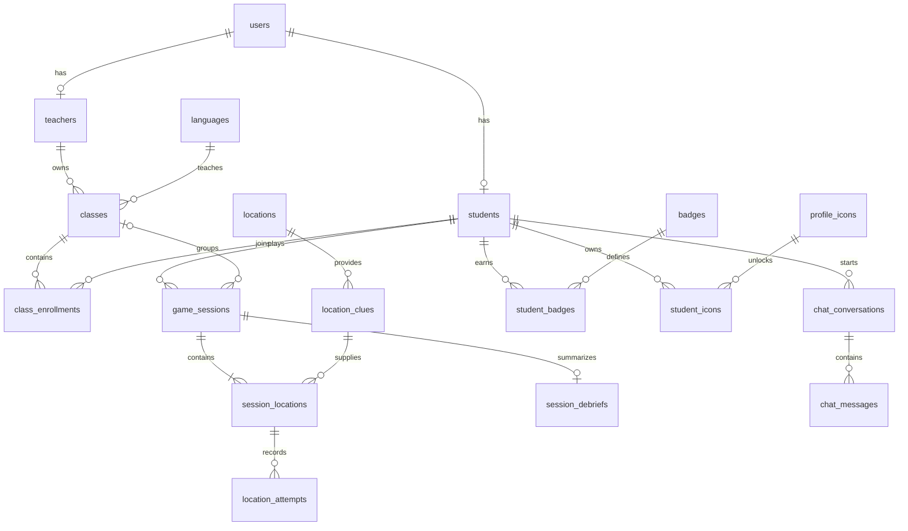

# PostgreSQL database design

The schema is based on the attached **499 - Team 7 Project Proposal.pdf**, including both milestones.
The repository also contains a [Markdown version of the proposal](../Proposal/499%20-%20Team%207%20Project%20Proposal.md).
SQL lives in [001_initial_schema.sql](../../src/backend/migrations/001_initial_schema.sql);
reference data lives in [002_seed_catalogs.sql](../../src/backend/migrations/002_seed_catalogs.sql).
[003_remove_global_leaderboard.sql](../../src/backend/migrations/003_remove_global_leaderboard.sql)
removes the global leaderboard following the updated project requirements. Previously applied
migrations stay unchanged; run the migration command to apply the current design.

## Tables and requirements

| Tables | Purpose |
| --- | --- |
| `users` | Firebase UID, unique email/username, names, student/teacher/admin role |
| `students`, `teachers` | Role-specific records; student numbers and equipped icons |
| `authorized_teacher_emails` | Teacher signup allowlist checked by the backend |
| `languages`, `difficulty_levels` | Language catalog and configurable gameplay rules |
| `classes`, `class_enrollments` | Teacher-owned language classes and student rosters |
| `student_languages` | Languages a student studies, independently of enrollment |
| `locations`, `location_clues` | Campus rooms, GPS targets, localized audio clues, hints and vocabulary |
| `game_sessions` | Language/difficulty, optional class, timer, pause/resume and terminal state |
| `session_locations` | Five ordered hunt objectives, skips, replays, failures, hints and provisional points |
| `location_attempts` | Photo references, OCR result, GPS coordinates and verification results |
| `badges`, `student_badges` | Language-specific achievement definitions and earned badges |
| `profile_icons`, `student_icons` | Reward catalog, ownership and point cost paid at redemption |
| `session_debriefs` | Post-hunt summary, struggled vocabulary and suggested review words |
| `chat_conversations`, `chat_messages` | Language/difficulty-specific chatbot history |
| `schema_migrations` | Applied migration versions, checksums and timestamps |

Files such as audio clips, photos, badge art and icons live in object storage; PostgreSQL stores their URLs/keys.
No campus coordinates, playable audio, badges, reward art or real user accounts are invented in the seed data.
Populate 15–20 verified campus locations and the language/difficulty clues before enabling hunts.

## Relationships



## Authentication and authorization

Firebase Authentication remains the credential provider as chosen in the proposal. Store the verified
Firebase UID in `users.firebase_uid`; Firebase handles passwords, resets and token revocation.
The proposal also mentions SQL password hashes, which conflicts with its chosen authentication stack;
this implementation follows Firebase Auth and does not duplicate passwords in PostgreSQL.

Insert a `users` record and its matching `students` or `teachers` record in the same transaction.
Admin accounts need only a `users` row. Composite foreign keys prevent assigning a student to the
teacher subtype, and classes reference the teacher subtype directly.
The backend must verify Firebase tokens, check the teacher email allowlist at signup, and enforce the
caller’s role/ownership on every protected endpoint. These migrations do not implement authentication
or the proposal's gameplay APIs; the connection health endpoint is the only new API route.

## Difficulty defaults

| Difficulty | Audio replays | Photo attempts | Time limit | Points per location | Clue style |
| --- | --- | --- | --- | --- | --- |
| Basic | Unlimited | 3 | 30 minutes | 10 | Numbers |
| Advanced | 3 | 2 | 20 minutes | 20 | Numbers and description |
| Expert | 2 | 1 | 10 minutes | 30 | Description |

Replay/attempt/timer values follow the proposal’s examples. Point values are development defaults
because the proposal gives no exact amounts. Adjust the catalog values to tune gameplay.
Copy the timer, attempt, replay and point settings into a session when creating it, preserving
the rules of existing sessions after catalog changes.
The proposal’s three-failure skip rule conflicts with Advanced/Expert attempt limits of two/one;
store consecutive failures, but settle that gameplay rule before implementing the skip API.

## Sessions and scores

Create a session and its five objectives in one transaction. Choose five distinct active locations with
clues matching the selected language and difficulty. Constraints enforce unique locations, unique positions
from 1–5, and matching session/clue context. The backend must enforce **exactly five** objectives before
committing and validate all objectives have finished before completing the session.

Persist `elapsed_seconds` and pause timestamps when pausing/resuming. End sessions with an `ended_at`
timestamp; set `paused_at` to NULL when resuming or ending. A student can have one active/paused session.
Reset by marking the old session `reset` and creating a fresh session in the same transaction;
this preserves attempts and history instead of overwriting them.

The backend checks timer/replay/attempt limits, calculates GPS distance, verifies OCR, and awards points
only for verified successes. `location_attempts.succeeded` is computed from both verification flags.
`session_locations.points_awarded` is the provisional per-location score used by the live UI.
Only completed hunts contribute to permanent scores and the wallet, following the proposal’s
requirement to reject leaderboard scores from incomplete sessions.

| View | Purpose |
| --- | --- |
| `student_point_totals` | Lifetime earned, spent and available points |
| `class_student_progress` | Current roster, class points, levels played and completed |
| `class_leaderboard` | Students ranked by earned points within each class |

The class leaderboard counts sessions assigned to that class. Personal point totals count all
completed sessions for reward redemption. Redeeming rewards lowers the spendable balance without lowering earned leaderboard
points. Ties share a dense rank. Removing an enrollment clears its class association from sessions,
removing class-specific progress while preserving personal session history and lifetime earnings.
Deleting a user cascades through their student history; deleting a teacher deletes their classes,
detaching class sessions while preserving student history.

Use `redeem_profile_icon` for all purchases. It locks the student row to serialize purchases,
checks the current balance, records the actual cost paid and rejects repeat purchases.
Use PostgreSQL's default READ COMMITTED isolation for this helper. Avoid directly inserting ownership
records for purchases or editing/deleting previously credited sessions, which would bypass balance checks.
The equipped icon foreign key permits only an owned icon; NULL uses a default avatar.

## Backend usage

Use parameterized queries and the shared connection context manager:

```python
from database import get_connection

with get_connection() as connection:
    profile = connection.execute(
        "SELECT id, username, role FROM users WHERE firebase_uid = %s",
        (verified_firebase_uid,),
    ).fetchone()

    # For a student, after checking the authenticated caller's role:
    connection.execute(
        "SELECT redeem_profile_icon(%s, %s)",
        (profile["id"], requested_icon_id),
    )
```

The context manager commits on success, rolls back on failure and closes the connection.
The schema uses PostgreSQL primary keys, foreign keys, checks and unique indexes as described in the
[PostgreSQL constraints documentation](https://www.postgresql.org/docs/17/ddl-constraints.html).
Connection/transaction handling follows [Psycopg's documentation](https://www.psycopg.org/psycopg3/docs/basic/usage.html).
Local Compose uses the [official PostgreSQL image](https://hub.docker.com/_/postgres).
